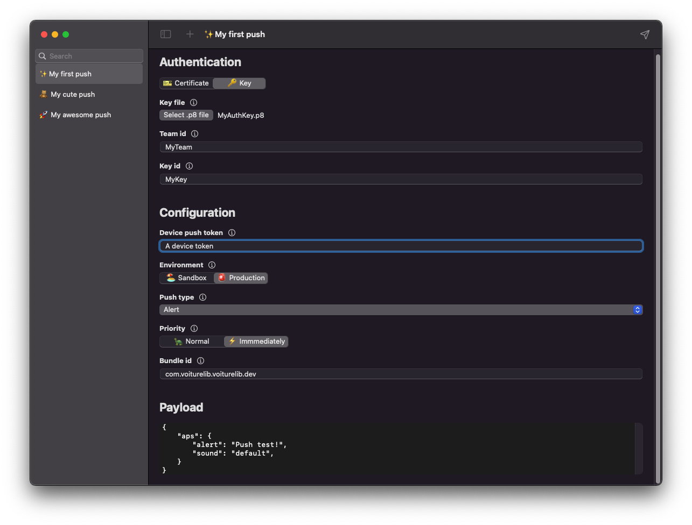

<h1 align=center>Swush</h1>

## ✨ Description

A macOS app to push notifications to APNS with ease. ⚡

- 💾 Persisted push for easy replay.
- 🎟️ Automatically retrieve APNS certificates from your keychain.
- ❤️ Made using SwiftUI.

## 🧑‍⚖️ License

Swush is licensed under [The MIT Licence (MIT)](LICENSE).

## 👨🏻‍💻 Developer

- Quentin Eude
  - [Github](https://github.com/qeude)
  - [LinkedIn](https://www.linkedin.com/in/quentineude/)
